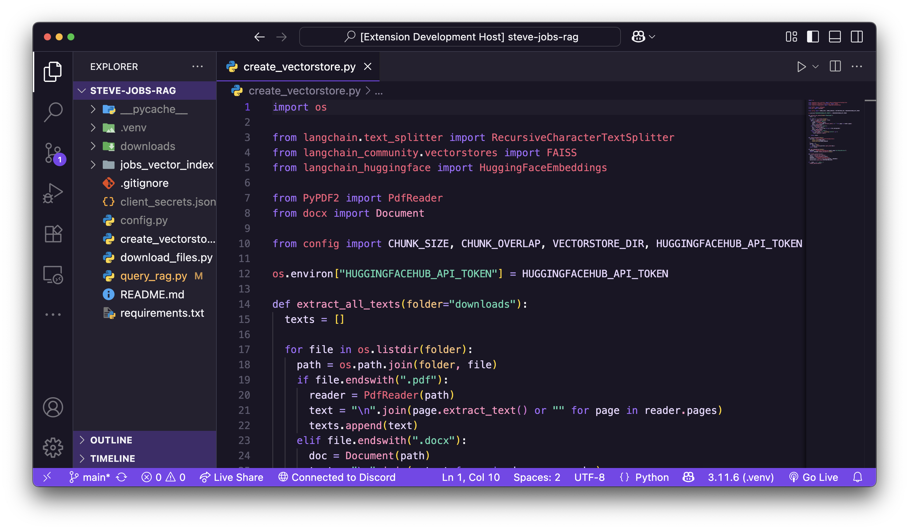

# 🌌 Amethyst Night — VS Code Theme

A refined dark theme for Visual Studio Code, **Amethyst Night** wraps your code in deep indigo shadows and soft amethyst hues. Built for clarity, calm, and contrast, it's designed to support long hours of focused coding across a wide range of languages.



---

## 🎨 Features

- 🌙 **Elegant dark UI** with deep violet backgrounds
- 💎 **Soft neon syntax** colors (lavender, mint, rose) for excellent readability
- 🧠 **Semantic token support** for enhanced language intelligence
- ✍️ Carefully themed JSON keys, markdown formatting, decorators, git decorations, and more
- 🧩 Supports JavaScript, Python, TypeScript, HTML, CSS, Markdown, and more

---

## 🚀 Installation

1. Open **Extensions** sidebar: `Ctrl + Shift + X`
2. Search for **Amethyst Night**
3. Click **Install**
4. Open the Command Palette: `Ctrl + K Ctrl + T`  
5. Select **Amethyst Night** from the list

---

## 💾 Recommended Settings

For the best experience:

```jsonc
"editor.fontLigatures": true,
"editor.cursorSmoothCaretAnimation": true,
"editor.fontFamily": "Fira Code, JetBrains Mono, Menlo, monospace"

---

## 🪪 License

This theme is released under the MIT License.

---

Made by Ritam Chakraborty